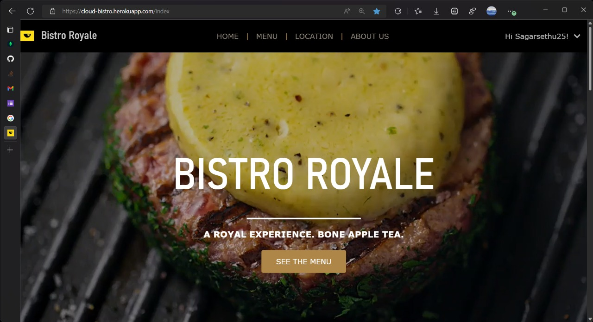
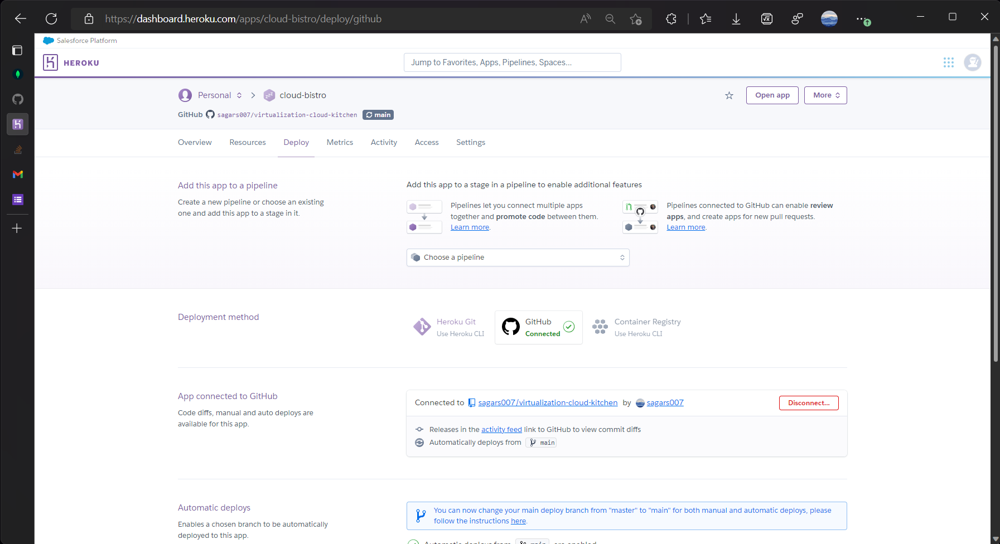
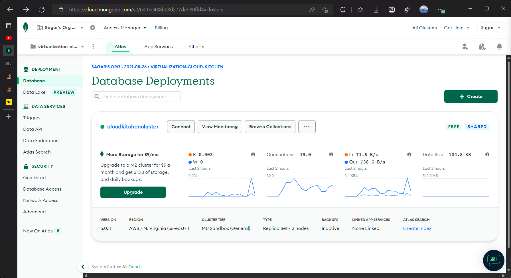

# Bistro Royale website

Cloud kitchen service web app using Node.js, MongoDB. Fully deployed on the cloud!

https://cloud-bistro.herokuapp.com/index

Mongodb atlas- https://www.mongodb.com/atlas/database

Nodejs Dependencies:
* ejs
* express
* express-session
* mongodb
* mongoose
* nodemailer
* nodemon

JSON file: 
* newDatabase is the json file to import menu items data into mongodb 'items' collection of tgs database.

By ss007

